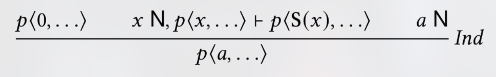
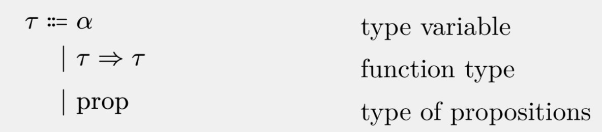
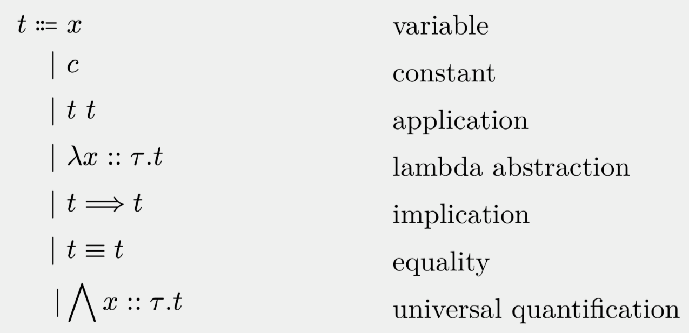
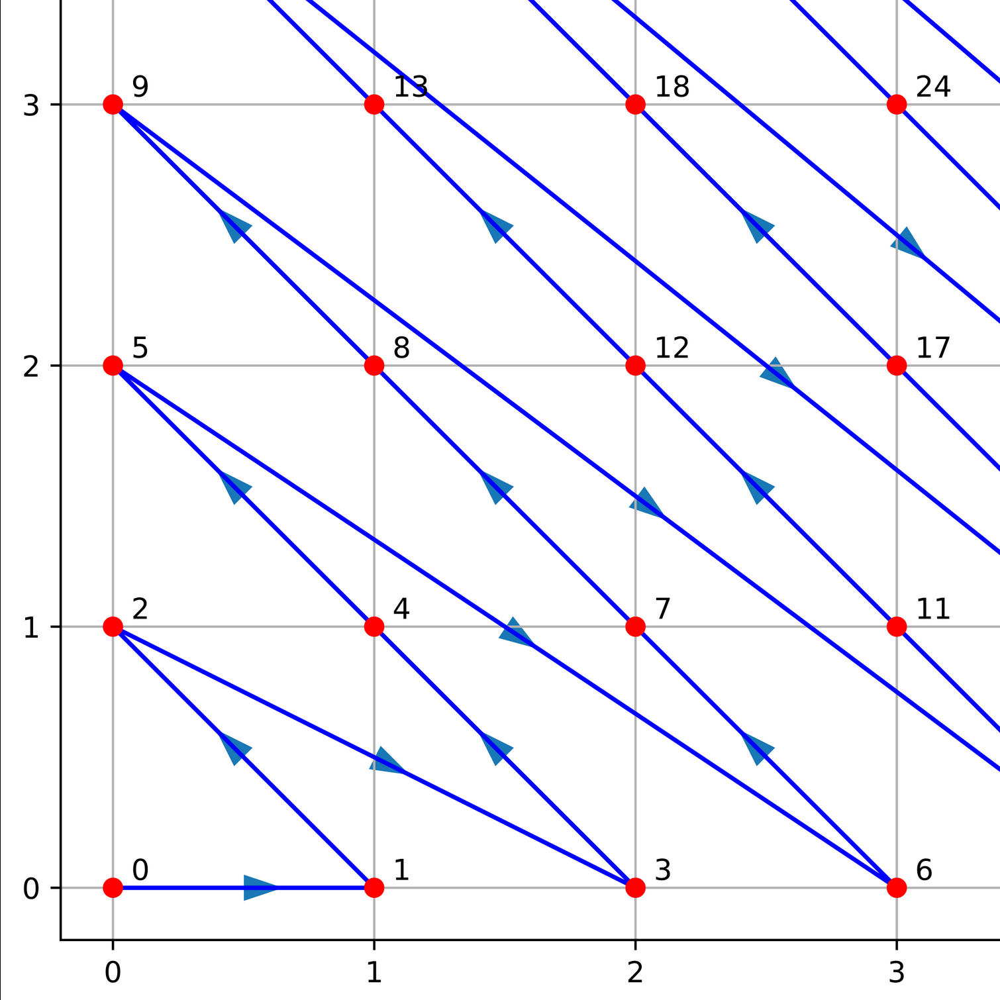

Context: The Grounded Universe
==

<!-- pause -->
## Grounded Deduction in short
- goal: unrestricted recursion in definitions

```typst +render
$ f " " x equiv f " " (x + 1) $
```

- goal 2: remain consistent
- consequence: weaken inference rules



- Grounded _Deduction_: a logical framework
- Grounded _Arithmetic_: a specific instantiation

---

Formalizations of GA
==

## Prior Work
- Goal: Study meta-logical properties of _GA_
  - is _GA_ consistent?
  - can _GA_ express all primitive-recursive functions?
  - can you encode the quantifiers of _GA_ as computations?
- Solution: Formalize _GA_ in Isabelle/HOL
  - deeply embed _GA_ in HOL
  - reason about the embedding using HOL

## This Thesis
- Trusts the prior work (_GA_ is worthwhile)
- New goal: provide GA as a proof assistant itself
- Solution: Formalize within a minimal logical framework

---

Deep Embedding vs Encoding
==

<!-- pause -->
## Deep Embedding in Strong Meta-Logic

- encode terms as an inductive type
- encode inference rules as inductive predicate

```
inductive derives :: "prf_proof ⇒ trm fset ⇒ trm ⇒ bool" ("_ 𝒟⟦_ ⊢ _⟧" [50,50,50] 50) where
    pr_subs: "P 𝒞⟦Γ ⊢ c⟧ ⟹ P 𝒟⟦M⇂Γ ⊢ M⇂c⟧"
  | pr_hyp: "P 𝒟⟦a ▷ Γ ⊢ a⟧"
  | pr_wk1: "P 𝒞⟦Γ ⊢ c⟧ ⟹ P 𝒟⟦a ▷ Γ ⊢ c⟧"
  | pr_negE:  "P 𝒞⟦Γ ⊢ ¬a⟧ ⟹ P 𝒞⟦Γ ⊢ a⟧ ⟹ P 𝒟⟦Γ ⊢ c⟧"
  | pr_dnegI: "P 𝒞⟦Γ ⊢ a⟧ ⟹ P 𝒟⟦Γ ⊢ ¬¬a⟧"
  | pr_dnegE: "P 𝒞⟦Γ ⊢ ¬¬a⟧ ⟹ P 𝒟⟦Γ ⊢ a⟧"
  | pr_disjI1: "P 𝒞⟦Γ ⊢ a⟧ ⟹ P 𝒟⟦Γ ⊢ a ∨ b⟧"
  | pr_disjI2: "P 𝒞⟦Γ ⊢ b⟧ ⟹ P 𝒟⟦Γ ⊢ a ∨ b⟧"
```

- "GA term is HOL data"

## Encoding in Logical Framework

- minimal meta-logical calculus
  - object logic directly extends it
- thus: provability is native

---

Thesis Roadmap
==

1. Formalize GA inference rules in Isabelle/Pure
2. Define basic arithmetic functions & prove basic properties

<!-- column_layout: [1,1] -->

<!-- column: 0 -->
  ```typst +render
  $ x <= y ==> y <= z ==> x <= z $
  ```
  <!-- pause -->
  ```typst +render
  $ x " " N ==> x < S(x) $
  ```
<!-- column: 1 -->
  <!-- pause -->
  ```typst +render
  $ x " " N ==> y " " N ==> x <= y ==> x != y ==> x < y $
  ```
  <!-- pause -->
  ```typst +render
  $ x " " N ==> y " " N ==> "div" x " " S(y) " " N $
  ```

<!-- reset_layout -->

3. Automation of proofs
  - subgoal solver
  - convenience methods: (un)folding definitions, case analysis,...
4. Encode inductive datatypes into GA.
  - original goal: provide a definitional mechanism

  ```
  declaretype List =
  | Nil
  | Cons of "nat" "List"
  ```

---

Formalization in Pure
==

## Briefly: the Pure calculus
- a typed lambda calculus
- distinct type `prop`
- adds implication, equality, universal quantification

<!-- column_layout: [1,1] -->

<!-- column: 0 -->

<!-- column: 1 -->
<!-- pause -->

<!-- reset_layout -->

---

Formalization in Pure
== 

<!-- pause -->
## Extending Pure
1. Declare a type of object-level propositions `o`
<!-- pause -->
```
typedecl o
```
2. Define predicate implicitly converting `o` to `prop`
```
judgment
  Trueprop :: ‹o ⇒ prop›  (‹_› 5)
```
3. Axiomatize away
```
axiomatization
  disj :: ‹o ⇒ o ⇒ o›  (infixr ‹∨› 30) and
  not :: ‹o ⇒ o› (‹¬ _› [40] 40)
where
  disjI1: ‹P ⟹  P ∨ Q› and
  disjI2: ‹Q ⟹  P ∨ Q› and
  disjI3: ‹⟦¬P; ¬Q⟧ ⟹  ¬(P ∨ Q)› and ...
```

---

Formalization in Pure
==

## Next: natural numbers

1. Declare a type of natural numbers `num`
<!-- pause -->
```
typedecl num
```

2. Give `num` structure by axiomatizing it.

```
axiomatization
  eq :: ‹'a ⇒ 'a ⇒ o›  (infixl ‹=› 45)  and
  zero :: ‹num›                         and
  suc :: ‹num ⇒ num›     (‹S(_)› [800]) and
  pred :: ‹num ⇒ num›    (‹P(_)› [800])
where
  eqSubst: ‹⟦a = b; Q a⟧ ⟹  Q b› and
  eqSym: ‹a = b ⟹  b = a› and
  nat0: ‹zero N› and
  ind: ‹⟦a N; Q zero; ⋀x. x N ⟹  Q x ⟹  Q S(x)⟧ ⟹  Q a›
  ...
```

<!-- pause -->

```
definition isNat :: ‹num ⇒ o› (‹_ N› [21] 20)
where "x N ≡ x = x"
```
 
---

Formalization in Pure
==

## How to axiomatize recursive definitions?

<!-- pause -->
```
axiomatization
  def :: ‹'a ⇒ 'a ⇒ o› (infix ‹:=› 10)
where
  defE: ‹⟦a := b; Q b⟧ ⟹ Q a› and
  defI: ‹⟦a := b; Q a⟧ ⟹ Q b›
```

<!-- pause -->

## Recursive definitions of arithmetic functions

<!-- pause -->

```
axiomatization
  add   :: "num ⇒ num ⇒ num"  (infixl "+" 60) and
  div   :: "num ⇒ num ⇒ num"                  and
  omega :: "'a"
where
  add_def:   "add x y  := if y = 0 then x else S(add x (P y))"       and
  div_def:   "div x y  := if x < y = 1 then 0 else S(div (x - y) y)" and
  omega_def: "omega    := omega"

```

---

Termination Proofs
==

<!-- pause -->

```
lemma add_terminates [auto]:
  assumes x_nat: ‹x N›
  assumes y_nat: ‹y N›
  shows ‹add x y N›
proof (rule ind[where a=y])
  show "y N" by (rule y_nat)
  show "add x 0 N"
    proof (rule defE[OF add_def])
      show "if (0 = 0) then x else S(add x P(0)) N"
        apply (rule eqSubst[where a="x"])
        apply (rule eqSym)
        apply (rule condI1)
        apply (rule zeroRefl)
        apply (rule x_nat)
        apply (rule x_nat)
        done
    qed
  show ind_step: "⋀a. a N ⟹ ((x + a) N) ⟹ ((x + S(a)) N)"
    proof (rule defE[OF add_def])
      fix a
      assume a_nat: "a N" and BC: "add x a N"
      show "if (S(a) = 0) then x else S(add x P(S(a))) N"
      ...
qed
```

---

...200 Lemmas later...
==

- some highlights
<!-- pause -->
```
lemma strong_induction:
  shows "a N ⟹  Q 0 ⟹  (⋀x. x N ⟹  (⋀y. y N ⟹  y ≤ x = 1 ⟹  Q y) ⟹  (Q S(x))) ⟹  Q a"
```
<!-- pause -->
```
lemma "n N ⟹  m N ⟹  ack m n N"
```

---

Tooling & Automation
==

- so far: every proof line is essentially `apply(axiom)` or `apply(lemma)`
- goal: convenience methods & auto solver
- solution 1: specialize Isabelle-native `simp` with a GA-specific subgoal solver
- solution 2: handwrite methods in ML

## Case Study
```
lemma cpy_strict_mono [simp]: "x N ⟹  cpy (S x) < (S x) = 1"
proof (induct strong x)
  case Base
    from Base show ?case
      by (unfold_def cpy_def, simp)
next
  case (Step xa)
    fix y
    assume hyp: "⋀y. y N ⟹  y ≤ xa = 1 ⟹  cpy (S y) < (S y) = 1"
    from Step show ?case
      apply (unfold_def cpy_def, simp)
      apply (cases bool: "cpx (S xa) = 0")
      apply (simp add: cpx_suc)+
      apply (cases bool: "cpx xa = 0")
      apply (simp add: cpx_suc cpy_suc)+
      apply (subst "S P xa = xa", simp)
      ...
```

---

Encoding inductive datatypes in GA
==

- why? inductive datatypes very useful for formalizations
- initial goal: inductive datatype 'compiler'
  - proved out of scope of thesis

```
declaretype List =
| Nil
| Cons of "nat" "List"
```
- new goal
  - come up with general framework for encoding inductive datatypes in GA
  - manually encode a `List` datatype, manually prove all required properties

---

Properties of inductive datatypes
==

<!-- pause -->

```
ind_type =
| Constructor_1 type_11 ... type_1i
| ...
| Constructor_n type_n ... type_nj
```

<!-- pause -->

{Nil} U {Cons 0 Nil, Cons 1 Nil, ...} U {Cons 0 (Cons 0 Nil), ..} U ...

- *Closure*: applying a constructor to arguments (that are valid elements
of their respective types) yields a valid element of the type
  - e.g. n N ⟹  is_list xs ⟹ is_list (Cons n xs) and is_list Nil.
- *Exhaustiveness*: every element of the datatype must be built from some constructor (no “extra” elements beyond closure)
- *Distinctness*: different constructors build different elements
  - e.g. Nil ≠ Cons n xs for any
n, xs.
- *Injectivity*: each constructor is injective in its arguments
  - e.g. Cons n xs = Cons m ys ⟹
 n = m ∧ xs = ys.
- *Induction principle*: properties of elements of the datatype can be proved by showing they hold for each constructor case, assuming the property for recursive arguments.
  - e.g. show for Nil and show for Cons n xs assuming property holds for xs.

==> Goal: encode `List` into `num` s.t. encoding fulfills all these properties

---

Encoding of constructors
==

- inductive datatype is syntactically a `num`

```
type_synonym List = num
```

- basic idea: encode vector of arguments with injective pairing function

<!-- pause -->

```typst +render
$ ⟨"type_tag", ⟨"constructor_tag", ⟨a_1, ⟨…, ⟨a_(n−1), a_n⟩…⟩⟩⟩⟩ $

$ "Cons n xs" = ⟨"list_type_tag", ⟨"cons_tag", ⟨n, ⟨"xs"⟩⟩⟩ $
```

- choose ⟨\_, \_⟩ as the cantor pairing function




<!-- pause -->

==> constructor encoding yields *distinctness* and *injectivity* for free

---

Type Membership
==

- a `List` is just a `num`.
- solution: type membership predicate
  - e.g. is_list x
  - needs to fulfill *closure* and *exhaustiveness* and must be decidable (terminating)
- 

```
axiomatization
  is_list :: "num ⇒ o" and
  is_cons :: "num ⇒ o"
where
  is_cons_def: "is_cons x := (cpi 1 x = list_type_tag)
                              ∧ (cpi 2 x = list_cons_tag)
                              ∧ ((cpi 3 x) N)
                              ∧ (is_list (cpi' 4 x))" and
  is_list_def: "is_list x := if x = 0
                               then False
                             else if x = Nil
                               then True
                             else if is_cons x
                               then True
                             else False"
```

<!-- pause -->

==> next: some key theorems

---

Termination of is_list
==

```
lemma list_cons_term [auto]: "x N ⟹ (is_list x B) ∧ (is_cons x B)"
proof (induct strong x)
  case Base
    show "x N ⟹ (is_list 0 B) ∧ (is_cons 0 B)"
      apply (unfold_def is_list_def)
      apply (unfold_def is_cons_def)
      apply (unfold_def is_list_def)
      apply (simp)
      done
next
  case (Step xa)
    fix y
    assume hyp: "(⋀y. y N ⟹ y ≤ xa = 1 ⟹ (is_list y B) ∧ (is_cons y B))"
    from Step show ?case
      apply (unfold_def is_list_def)
      apply (unfold_def is_cons_def)
      apply (simp)
      apply (rule condTB, simp)+
      apply (rule conjE1, rule hyp, simp, rule le_suc_implies_leq, simp)+
      done
qed
```

---

Constructor Distinctness
==

```
lemma [auto]: "n N ⟹ xs N ⟹ ¬ Nil = Cons n xs"
unfolding Nil_def Cons_def by simp

lemma [auto]: "n N ⟹ xs N ⟹ ¬ Cons n xs = Nil"
unfolding Nil_def Cons_def by simp
```

---

Closure
==

<!-- pause -->

```
lemma cons_decode [auto]:
  "is_cons x ⟹ x N ⟹ ∃n xs. ((n N) ∧ is_list xs ∧ x = Cons n xs)"
apply (rule existsI[where a="cpi 3 x"], simp+)
apply (rule existsI[where a="cpi' 4 x"], simp+)
apply (unfold Cons_def)
apply (subst rule: cons_1_tag)
apply (subst rule: cons_2_2)
apply (rule cp4_reconstr, simp+)
done
```

<!-- pause -->

```
lemma [auto]: "n N ⟹ xs N ⟹ is_list xs ⟹ is_cons (Cons n xs)"
unfolding Cons_def by (unfold_def is_cons_def, simp)

lemma cons_is_list [auto]:
  "n N ⟹ xs N ⟹ is_list xs ⟹ is_list (Cons n xs)"
apply (unfold_def is_list_def)
apply (unfold_def is_cons_def)
apply (unfold Cons_def)
apply (simp)
done
```

---

Case Distinction
==

```
lemma list_cases: "x N ⟹ is_list x ⟹ (x = Nil) ∨ (∃n xs. (n N) ∧ is_list xs ∧ (x = Cons n xs))"
apply (rule implE[where a="is_list x"])
apply (unfold_def is_list_def)
apply (cases bool: "x=Nil", simp+)
apply (rule implI, simp)
apply (rule disjI1, simp)
apply (cases bool: "is_cons x", simp+)
apply (rule implI)
apply (rule condTB, simp)+
apply (simp+)
apply (rule implI, simp)
apply (rule exF[where P="False"], simp)
done
```

---

Induction
==

- a very important property of the encoding: it is strictly increasing in the shape of the datatype

```
lemma [simp]: "xs N ⟹ is_list xs ⟹ n N ⟹ xs < Cons n xs = 1"
unfolding Cons_def by simp
```

<!-- pause -->

```
lemma [case_names _ HQ Nil Cons, induct]:
  "is_list a ⟹ a N ⟹ Q Nil ⟹ (⋀x xs. x N ⟹ xs N ⟹ is_list xs ⟹ Q xs ⟹ Q (Cons x xs)) ⟹ Q a"
apply (rule implE[where a="is_list a"])
apply (induct strong a)
...
    proof (cases "S xa", simp)
      case Nil
        from Nil show ?case
          by (simp+)
    next
      case (Cons n xs)
        from Cons and cons show ?case
          ...
          done
    qed
qed
```

---

Conclusion for inductive datatypes
==

- skipped the formalization of cpairs entirely, explicit `List` proofs more interesting
- this scheme should work for any inductive datatype
  - given more time, full automation of definition was the next goal
- however, no polymorphic inductive types

---

Conclusion
==

- actual goal of thesis: does GA really work for reasoning?
  - any obvious inconsistencies/imprecisions in pen-and-paper formalization?
  - are *habeas quid* premises detrimental to any productivity in reasoning?
  - well automateable?
- answer: GA passed this initial usability test
  - almost everything worked as planned/expected
  - in particular, native recursive definitions allow for 'bootstrapping' lots of reasoning infrastructure
  - one small issue: 'semantic type' membership can't be proven to imply termination
    - e.g. I couldn't prove is_list x ==> x N
- excited to see what's next from Bryan's GD efforts!
